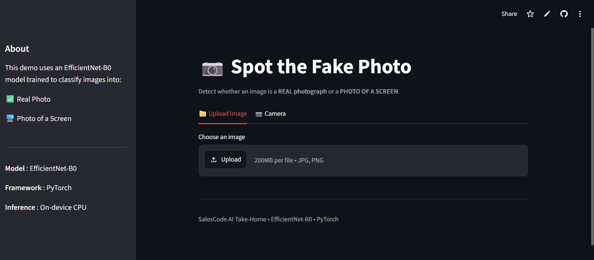
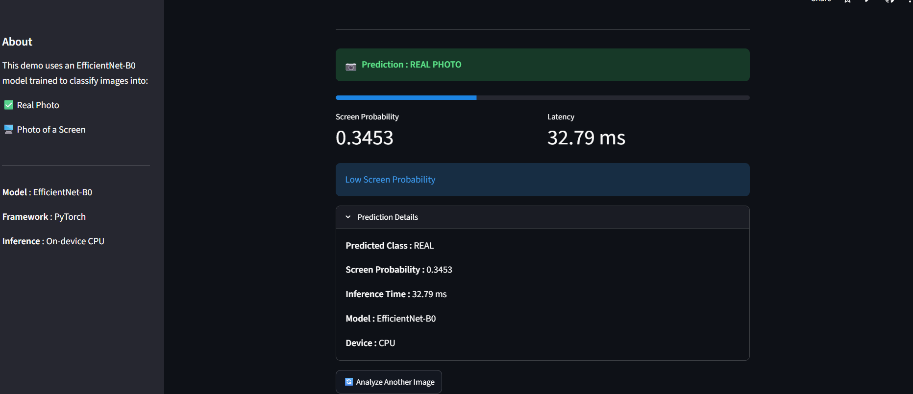
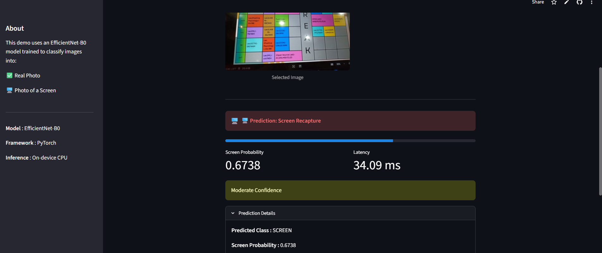
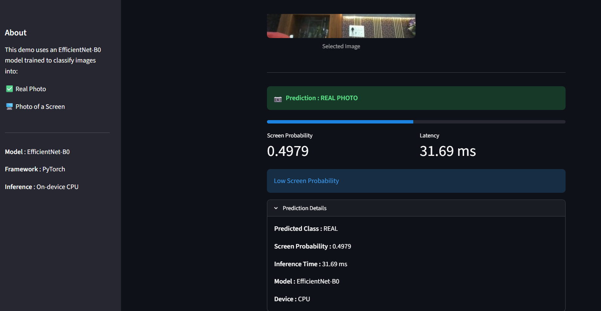
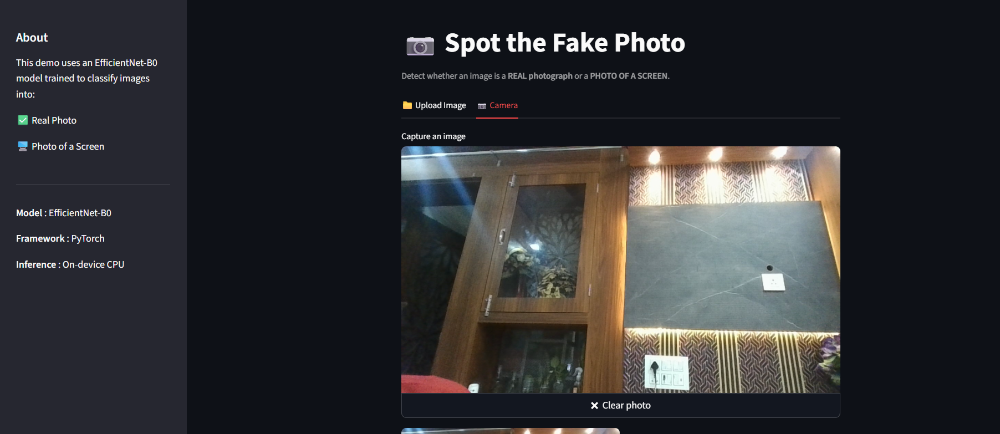

# 📷 Screen Recapture Detector

> A lightweight computer vision system that detects whether an image is a **real photograph** or a **photo of a digital screen (screen recapture)** using **EfficientNet-B0** and **PyTorch**.

<p align="center">


</p>

---

## 🚀 Live Demo

🌐 **Web Application**

https://screen-recapture-detector-bygauri.streamlit.app/

🎥 **Video Demonstration**

https://drive.google.com/file/d/1VRdDA_t8VBR_yCALZIwxKYdKfvqfkAhp/view?usp=sharing

---

## 📸 Application Preview

<p align="center">

</p>

---

# 📖 Overview

Screen recapture attacks occur when a genuine image is displayed on another device and photographed to bypass verification systems.

This project presents a lightweight deep learning solution that classifies an image as:

- 📷 **Real Photo**
- 🖥️ **Photo of a Screen**

The model is optimized for fast CPU inference and lightweight deployment while maintaining high classification accuracy.

---

# ✨ Features

- EfficientNet-B0 transfer learning
- Binary image classification
- Fast CPU inference
- Streamlit web application
- Image upload support
- Camera capture support
- Screen probability score (0–1)
- Inference latency reporting
- Command-line prediction interface

---

# 🧠 Model

| Property | Value |
|-----------|-------|
| Architecture | EfficientNet-B0 |
| Framework | PyTorch |
| Learning Strategy | Transfer Learning |
| Task | Binary Classification |
| Classes | Real Photo / Screen Recapture |

---

# 📊 Performance

| Metric | Result |
|---------|--------|
| Validation Accuracy | **~90%** |
| Framework | PyTorch |
| Inference Device | CPU |
| Output | Probability Score (0–1) |

---

# 🖼 Sample Predictions

<p align="center">


&nbsp;&nbsp;


</p>

<p align="center">


&nbsp;&nbsp;


</p>

---

# ✅ Assignment Requirements

✔ Lightweight model

✔ Fast inference

✔ Binary classification

✔ Probability score output (0–1)

✔ Command-line inference (`predict.py`)

✔ Streamlit web demo

✔ Source code included

---

# 🏗️ Project Structure

```text
screen-recapture-detector/

├── assets/
├── data/
├── models/
│   └── efficientnet_best.pth
│
├── src/
│   ├── dataset.py
│   ├── train_model.py
│   ├── inference.py
│   ├── features.py
│   └── utils.py
│
├── app.py
├── predict.py
├── requirements.txt
└── README.md
```

---

# ⚙️ Installation

Clone the repository

```bash
git clone https://github.com/gaurisoni2027/screen-recapture-detector.git
```

Install dependencies

```bash
pip install -r requirements.txt
```

Launch the application

```bash
streamlit run app.py
```

---

# 💻 Command Line Usage

Run inference on a single image:

```bash
python predict.py image.jpg
```

Example Output

```text
0.3872
```

### Output Interpretation

| Score | Prediction |
|--------|------------|
| **0.0** | Real Photo |
| **1.0** | Photo of a Screen |

---

# 🙏 Acknowledgement

Developed as part of the **SalesCode AI Computer Vision Take-Home Assignment**.

---

# 👩‍💻 Author

**Gauri Soni**

Computer Science Undergraduate

GitHub: https://github.com/gaurisoni2027